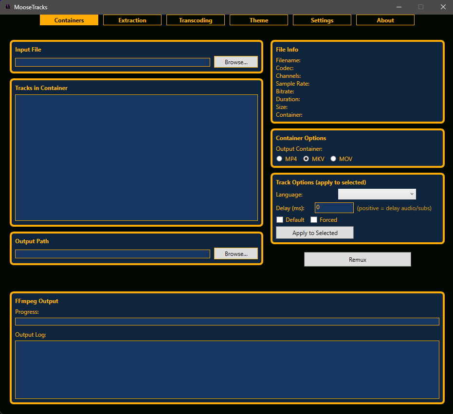
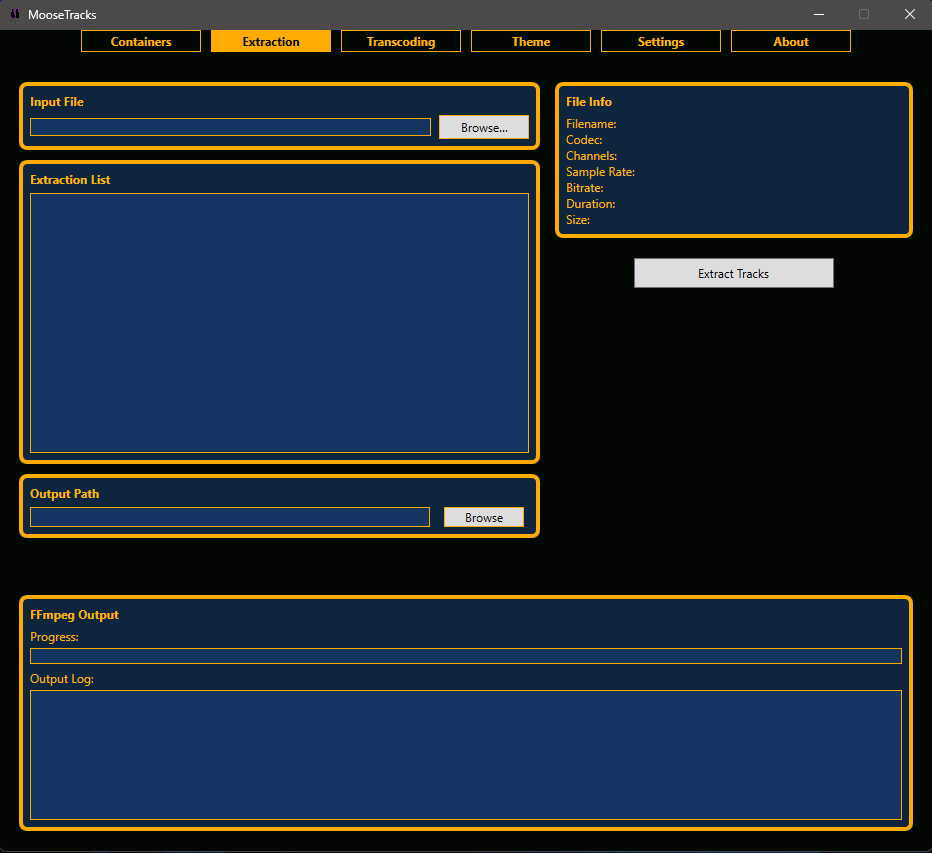
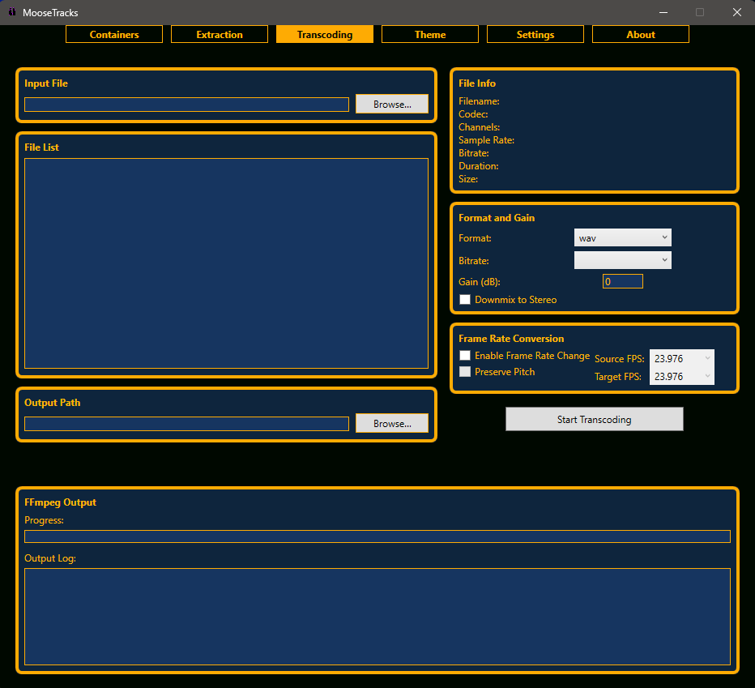
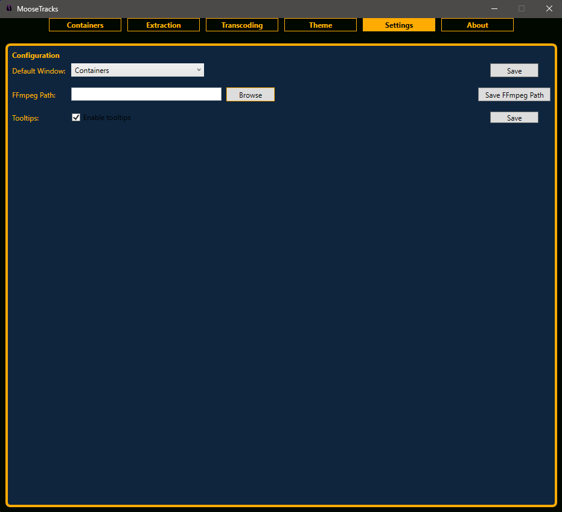
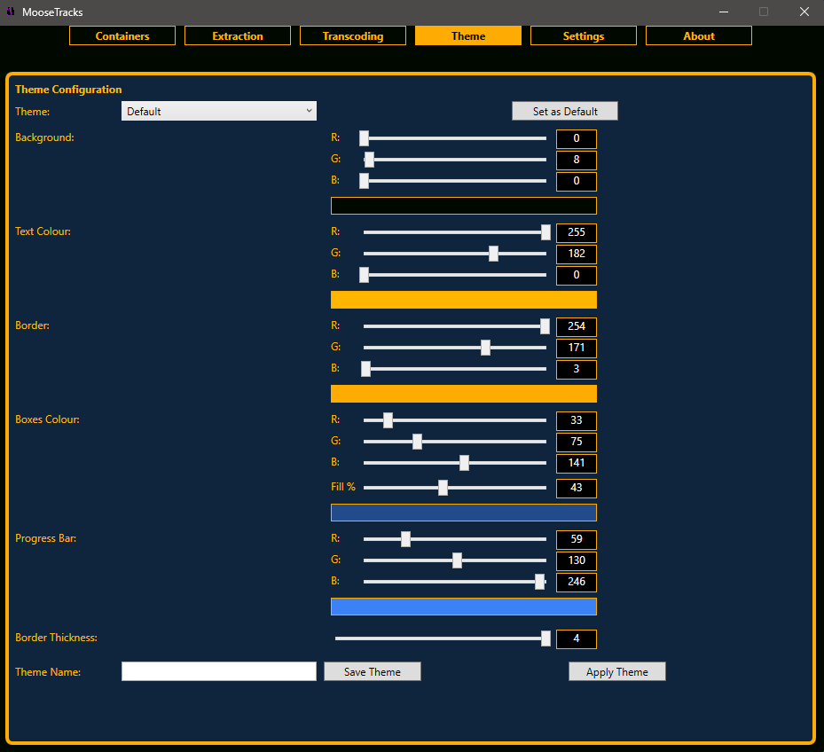
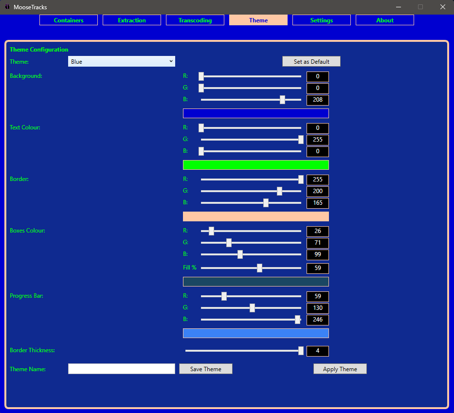
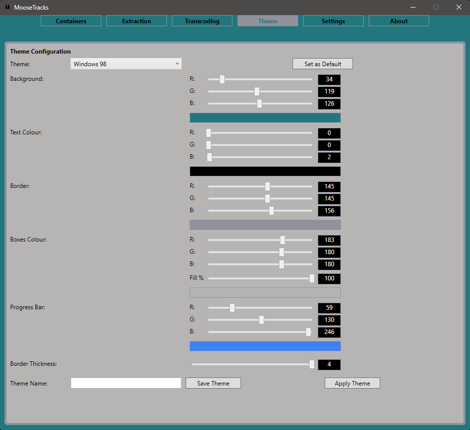
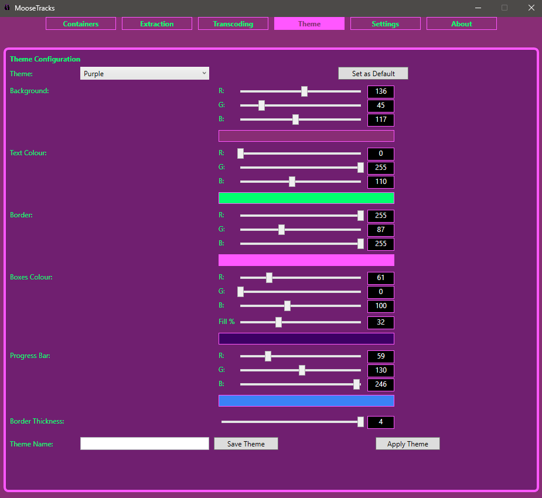

# Moosetracks

A clean, fast **Windows GUI for FFmpeg** focused on audio.  
Transcode audio, remux between containers, or extract audio/video/subtitle tracks — no command line required.

-important)

## Screenshots

- Core Views

  
  

  
  

- Theme Variations

  
   

  
   

## Installation

Moosetracks is **portable** — there’s nothing to install.  
You **must** have a **full FFmpeg** build available: ffmpeg.exe, ffprobe.exe, and ffplay.exe.

### 1) Get FFmpeg (Windows)

- Download a recent Windows **static** build of FFmpeg.
- Ensure it includes ffmpeg.exe, ffprobe.exe, and ffplay.exe.

### 2) Make FFmpeg available (choose ONE)

**Option A — Place FFmpeg inside the moosetracks folder**  
Create a folder inside your moosetracks directory (for example: .\ffmpeg\ or .\ffmpeg\bin\) and place ffmpeg.exe, ffprobe.exe, and ffplay.exe there (next to moosetracks.exe or within the subfolder that moosetracks is configured to look in).

**Option B — Add FFmpeg to the Windows PATH using Environment Variables**  
1. Put the three executables in a folder such as C:\ffmpeg\bin  
2. Open Start → Settings → System → About → Advanced system settings  
3. Click Environment Variables…  
4. Under System variables, select Path → Edit → New → add C:\ffmpeg\bin  
5. Click OK to close all dialogs

**Verify**  
Open Command Prompt and run:

    ffmpeg -version
    ffprobe -version
    ffplay -version

All three should print version information without errors.

### 3) Run Moosetracks

- Download the latest release from the Releases page.
- Extract anywhere (e.g., C:\Apps\moosetracks\).
- Double-click moosetracks.exe.

## Features

- Audio Transcoding (Re-encode)
  - Convert audio between codecs (e.g., AAC, MP3, FLAC, Opus, WAV — availability depends on your FFmpeg build).
  - Choose bitrate or quality mode (CBR/VBR as supported by the target codec).
  - Set sample rate and channels (mono/stereo).
  - Pick an output container suited to the codec (e.g., m4a, mp3, flac, opus, wav).
  - Optional stream copy (-c:a copy) to avoid re-encoding when you only need a different container.

- Container Operations (Remux)
  - Move audio into a different container without changing the codec (fast, lossless when compatible).
  - Built-in guidance when a selected container isn’t compatible with the source codec.

- Extract Audio From Containers
  - Pull the audio track out of a video or multi-stream file (e.g., mp4, mkv, mov).
  - Save via stream copy (no quality loss) or re-encode to a target codec when needed.

- Settings & Presets
  - Sensible defaults for common formats.
  - Save and recall your preferred options (when supported by the app version).

- Theme Switcher & Custom Colours
  - Built-in theme switcher (light/dark and custom accent colours).
  - Instantly preview different looks to match your preference or accessibility needs.

- Tooltips Throughout the UI
  - Every control has a tooltip explaining what it does and when to use it.
  - Complex options (stream copy vs. re-encode, container compatibility, etc.) are described in plain English.

- Progress & Logging
  - Clear progress for each job with start/finish states.
  - Live FFmpeg output to help diagnose issues (e.g., unsupported codec, missing decoder).

## Important Information

Moosetracks is a **front-end** for FFmpeg and does **not** bundle FFmpeg.  
Capabilities depend on your FFmpeg build and which codecs it includes.

- Licensing: FFmpeg and any codecs are licensed separately — ensure your usage complies with their licenses.
- Codecs: If a codec/format is missing or fails, your FFmpeg build may not include the required encoder/decoder.
- Performance: Speed and quality depend on your CPU/GPU, chosen codec, and settings.

## Contributing

Bug reports, feature requests, and pull requests are welcome.  
When reporting issues, include your FFmpeg version and (if possible) a small sample file plus the settings used.

## Support

- Use the in-app tooltips for quick guidance on each option.
- Check the FFmpeg output/log area when a job fails.
- If you still need help, please open an issue on the repository.

If moosetracks is helpful, consider starring the repo or sponsoring the project — thank you!

## Contributors

- [@syncromoose](https://github.com/syncromoose)
